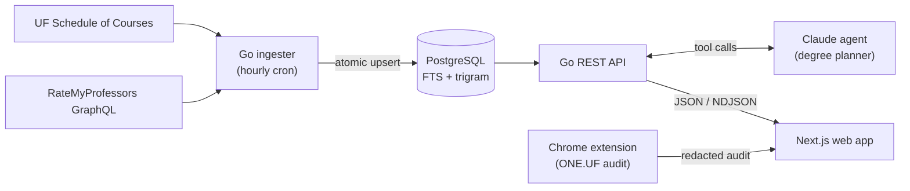

<div align="center">

# 🐊 GatorPlan

**A fast, conflict-aware class scheduler and AI degree planner for University of Florida students.**

Browse every UF course for the upcoming term with live meeting times, open seats, and professor ratings.
Build a conflict-free week in seconds, then let an AI agent turn your degree audit into a
semester-by-semester path to graduation.


</div>

<!-- Add a screenshot or GIF of the planner here, e.g.:
<p align="center"></p>
-->

---

## Why

Picking classes at UF means juggling the Schedule of Courses, ONE.UF, RateMyProfessors, and a
spreadsheet, all to answer one question:

> **"What can I take, when does it meet, and are there seats left?"**

GatorPlan answers that on a single screen, with no login and no instructions needed.

## Features

### 📅 Weekly planner
- **Instant course search** across code, title, description, and instructor, ranked and keyboard-driven (`/` to search, `⌘K` / `Ctrl+K` for quick add).
- **Live times and seats** for every section, with a freshness indicator so students know how current the data is.
- **Automatic conflict detection.** Adding a course picks the best-rated section that fits your week, and clashes are flagged right away.
- **Professor ratings inline.** RateMyProfessors scores and difficulty appear beside each section and link to the full profile.
- **UF-native details:** class periods (P1–E3, summer periods included), online/hybrid badges, credit totals, and average rating per schedule.

### 🎓 AI degree planner
- Upload a UF degree audit and set preferences: graduation term, credit load, summers, co-op/abroad terms, pace, interests, and must-take or avoided courses.
- A **Claude-powered agent** looks up real courses and prerequisites, can ask up to three clarifying questions, and produces a full plan. Each course comes with the requirement it satisfies, the reason it was picked, its prerequisites, and a professor rating. Each term gets a workload estimate.
- Plans are **validated in code, not just prompted.** A deterministic validator rejects any plan that breaks prerequisite order, credit caps, or unmet requirements until the agent fixes it.
- Results stream to the browser as NDJSON, so progress shows up live.

### 🧩 Chrome extension
- One click sends your degree audit from ONE.UF to GatorPlan, replacing a manual DevTools copy-paste.
- **Privacy by design:** asks for consent first, and strips your name, UFID, grades, and GPA *inside the tab* before anything leaves it. It requests only the `storage` permission.

## Architecture



| Component | Stack | Role |
| --- | --- | --- |
| [`server/`](server/) | Go, pgx, Anthropic Go SDK | Scraper/ingester, REST API, AI planning agent |
| [`web/`](web/) | Next.js 16 (App Router), React 19, TypeScript, CSS Modules | Weekly planner, degree planner UI |
| [`extension/`](extension/) | Chrome Manifest V3, vanilla JS | Degree audit import with on-device redaction |

## Engineering highlights

- **Resilient data pipeline.** Each term is replaced in a single Postgres transaction, so the API serves the old catalog or the new one, never a half-written one. Scrapes that come back suspiciously small are refused. When the authenticated session cookie expires, the ingester keeps the last good times and seats, then fires an alert webhook instead of wiping data.
- **Fast search without shipping the catalog.** The Postgres full-text index uses weighted `tsvector` columns (code > name > description), a prefix index for course codes, and `pg_trgm` for fuzzy instructor matching. API responses use `stale-while-revalidate` caching.
- **Prerequisite parser.** It turns UF's free-text prerequisites (`"(COP 3502 or COP 3504) and MAC 2311"`) into evaluable and/or rule trees. Anything it can't parse, like "instructor permission", is reported rather than silently dropped.
- **Guardrailed LLM agent.** Hard rules live in code and the prompt only steers. The agent gets four narrow tools, with caps on turns, plan submissions, and wall-clock time, plus per-IP rate limiting. User free text is sanitized and wrapped in data tags to resist prompt injection. Personal data from the audit (name, UFID, grades, GPA) never reaches the model.
- **Fuzzy name matching.** Instructors are matched to RateMyProfessors after accent, hyphen, and middle-name normalization, with an exact match first and a first + last name fallback.
- **Tested.** Unit tests cover term codes, SOC normalization, prereq parsing, rating matching, audit parsing, the plan validator, and the HTTP handlers. Database integration tests and redaction tests for the extension are included too.

## Getting started

**Prerequisites:** Go 1.27+, Node.js 20+, PostgreSQL 15+ (local or Supabase).

```sh
# 1. Backend
cd server
cp .env.example .env          # set DATABASE_URL (and optionally ONEUF_SESSION, ANTHROPIC_API_KEY)
createdb gatorplan
go run ./cmd/ingest           # first scrape, ~2–3 min per term
go run ./cmd/api              # http://localhost:8080

# 2. Frontend (new terminal)
cd web
npm install
npm run dev                   # http://localhost:3000, proxies /api/* to the Go API
```

Optional configuration:

| Variable | Enables |
| --- | --- |
| `ONEUF_SESSION` | Meeting times and open seats (UF only returns these to logged-in sessions). Without it, courses, sections, instructors, and ratings still load and times show as "TBA". |
| `ANTHROPIC_API_KEY` | The AI degree planner. Without it, `/api/plan` returns 503 and the rest of the app works normally. |
| `ALERT_WEBHOOK_URL` | Notifications when the session cookie expires. |

See [`server/README.md`](server/README.md) for ingestion flags, the full API reference, and planner
guardrails. See [`extension/README.md`](extension/README.md) for loading and packaging the extension.

### Running tests

```sh
cd server && go test ./...          # Go unit tests
cd extension && node --test         # redaction tests
cd web && npm run lint
```

## Project structure

```
gator-planner/
├── server/
│   ├── cmd/api, cmd/ingest     entry points
│   └── internal/
│       ├── soc/                UF Schedule of Courses client + normalization
│       ├── rmp/                RateMyProfessors client + name matching
│       ├── store/              Postgres migrations, ingest, queries
│       ├── prereq/             prerequisite text → boolean rules
│       ├── audit/              degree audit parsing (PII stripped)
│       ├── planner/            Claude agent loop, tools, plan validator
│       └── api/                HTTP handlers
├── web/src/
│   ├── components/planner/     planner UI (search, week grid, degree roadmap)
│   └── lib/                    scheduling logic, UF periods, API client
├── extension/                  Chrome MV3 degree audit importer
└── docs/design.md              original product spec & MVP requirements
```

## Design process

GatorPlan started as a written spec built on a user-centered design loop: student interviews,
wireframes, a vertical-slice build, and usability testing against one success metric.
**A new student should find an open section with its meeting time in under 60 seconds, unaided.**
The original requirements, data model, and risk analysis are in [`docs/design.md`](docs/design.md).

## Roadmap

- [ ] Day/time, gen-ed, and delivery-mode filters
- [ ] Saved schedules and shareable links
- [ ] Export to calendar (.ics)
- [ ] Sanctioned data feed from the UF Registrar to replace session-based scraping

---

<sub>GatorPlan is an independent student project and is not affiliated with or endorsed by the University of Florida.
Always confirm your plan with an academic advisor.</sub>
